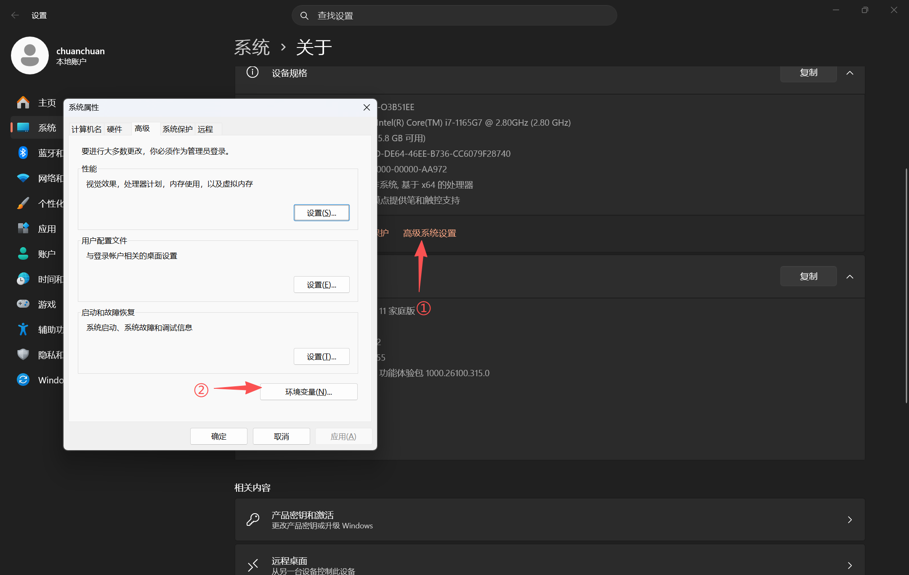
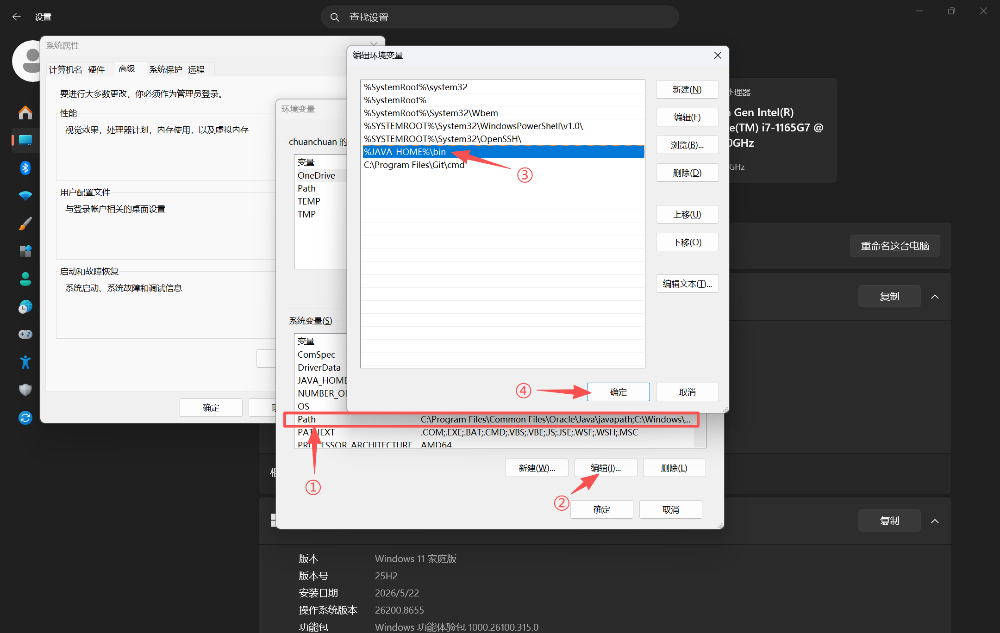

# ☕ Java 开发环境配置教程

>适用于 Windows 11 系统，从零开始安装 JDK 并配置环境变量。

---

## 1. 选择 JDK 版本与下载

> 本教程以JDK 21为例

**下载地址**：[https://www.oracle.com/java/technologies/downloads/](https://www.oracle.com/java/technologies/downloads/)  
选择需要下载的JDK版本 → `Windows` → `x64 Installer`，点击下载 `.exe` 安装包。


## 2. 安装 JDK

1. 双击下载的 `exe` 文件
2. 在安装向导中点击 **Next**。
3. 继续点击 **Next**，选择安装路径（默认安装在 `C:\Program Files\Java\` 文件夹下）。
4. 点击 **Install**，等待完成。

---

## 3. 手动配置环境变量

### 3.1 打开环境变量设置
- 右键点击 **此电脑** → **属性** → **高级系统设置**
- 点击 **环境变量** 按钮。


### 3.2 新建 JAVA_HOME 系统变量
1. 在“**系统变量**”区域点击 **新建**。
    - 变量名：`JAVA_HOME`
    - 变量值：JDK 的安装路径，例如 `"D:\softwares\java\jdk-21.0.10"`
    - 点击 **确定**。


### 3.3 配置 Path 变量
1. 在系统变量列表中找到 `Path` 变量，选中后点击 **编辑**。
2. 点击 **新建**，输入：`%JAVA_HOME%\bin`
3. 点击 **确定** 保存所有对话框。


### 3.4 验证环境变量
按下 `Win + R`，输入 `cmd` 回车打开命令提示符，输入：
```cmd
echo %JAVA_HOME%
```
如果输出你的 JDK 路径，说明配置正确。若提示未定义，请检查变量名是否完全一致，并重新打开命令行窗口。

---

## 4. 验证 Java 安装

打开新的 **命令提示符** 或 **PowerShell**（安装后必须新开窗口），依次执行：

```cmd
java -version
javac -version
```

正常输出示例：


如果提示 `java 不是内部或外部命令`，请重新检查环境变量配置，并确保命令行是**新打开的**。

---

## 5. 安装 IntelliJ IDEA

1. 访问 [JetBrains 官网](https://www.jetbrains.com/idea/download/) 下载 IDEA。
2. 双击安装程序，傻瓜式安装即可，**建议修改安装路径**，勾选与 `.java` 文件关联。
3. 安装完成首次启动时，可以选择是否导入旧配置，然后一路默认即可。
---

## 6. 你的第一个 Java 程序

1. 在任意目录新建文本文件，命名为 `HelloWorld.java`（注意显示扩展名，不要变成 `HelloWorld.java.txt`）。
2. 用记事本打开，输入以下代码并保存：
> 文件内容中字母的大小写必须严格一样
```java
public class HelloWorld {
   public static void main(String[] args) {
       System.out.println("Hello, Java on Windows!");
    }
}
```
3. 在文件所在目录的地址栏输入 `cmd` 回车，打开命令行。
4. 编译运行：
```cmd
javac HelloWorld.java
java HelloWorld
```
如果看到输出 `Hello, Java on Windows!`，说明环境完美运行。

---

至此，你已在 Windows 上成功搭建 Java 开发环境。尽情享受编程吧！ 🚀